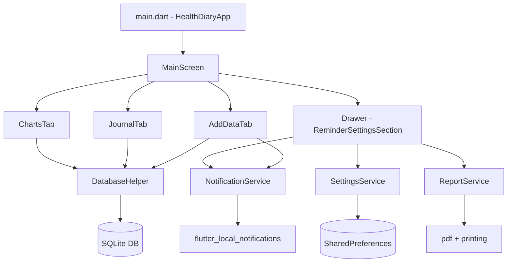
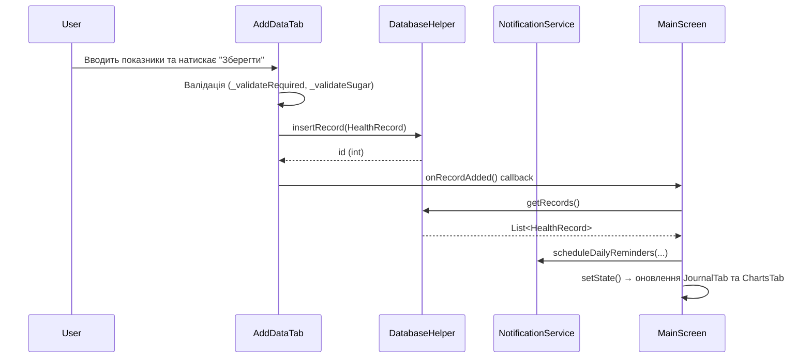

# Технічний дизайн — Hypertonic Journal (hyper_journal)

## Огляд

Hypertonic Journal — це Flutter-застосунок для моніторингу здоров'я, що дозволяє фіксувати показники артеріального тиску, пульсу та рівня цукру в крові двічі на день. Застосунок зберігає дані локально в SQLite, відображає динаміку на графіках, надсилає нагадування та генерує PDF-звіти.

### Ключові технічні рішення

- **Архітектура**: Монолітна структура з єдиним `lib/main.dart` для UI та окремими сервісами в `lib/services/`. Це свідоме рішення для невеликого застосунку — мінімальна складність, без зайвих абстракцій.
- **Управління станом**: `StatefulWidget` без зовнішніх бібліотек. Стан зберігається в `_MainScreenState` (список записів) і передається вниз через конструктори.
- **Персистентність**: SQLite через `sqflite` (мобільні) / `sqflite_common_ffi` (десктоп). Єдина таблиця `records`.
- **Локалізація**: ARB-файли з `flutter_localizations`. Відображення `ru → uk` реалізовано через `localeResolutionCallback`.

---

## Архітектура

### Загальна структура

```
lib/
├── main.dart                    # Точка входу + всі UI-віджети
├── models/
│   └── health_record.dart       # Модель даних HealthRecord
├── services/
│   ├── database_helper.dart     # SQLite CRUD (Singleton)
│   ├── notification_service.dart # Локальні сповіщення (Singleton)
│   ├── report_service.dart      # Генерація PDF
│   └── settings_service.dart   # SharedPreferences (Singleton)
└── l10n/
    ├── app_en.arb               # Англійська локалізація
    └── app_uk.arb               # Українська локалізація
```

### Діаграма компонентів



### Потік даних



---

## Компоненти та інтерфейси

### HealthDiaryApp (StatelessWidget)

Кореневий віджет застосунку. Налаштовує `MaterialApp` з темою Material 3 (teal), локалізацією та `localeResolutionCallback`.

**Ключовий метод:**
```dart
Locale _resolveLocale(Locale? deviceLocale) {
  if (deviceLocale == null) return const Locale('uk');
  if (deviceLocale.languageCode == 'ru') return const Locale('uk');
  if (deviceLocale.languageCode == 'uk') return const Locale('uk');
  return const Locale('en');
}
```

### MainScreen (StatefulWidget)

Головний екран із `DefaultTabController` (3 вкладки) та `Drawer`. Зберігає `List<HealthRecord> _records` — єдине джерело правди для всіх вкладок.

**Стан:**
- `_records: List<HealthRecord>` — всі записи, завантажені з БД

**Методи:**
```dart
Future<void> _loadRecords() async
// Завантажує записи з БД, оновлює стан, перепланує нагадування
```

**Передача даних вниз:**
- `AddDataTab(onRecordAdded: _loadRecords)` — callback для оновлення після збереження
- `JournalTab(records: _records, onDelete: ...)` — список для відображення
- `ChartsTab(records: _records)` — список для графіків

### AddDataTab (StatefulWidget)

Форма введення показників здоров'я.

**Стан:**
- `_formKey: GlobalKey<FormState>`
- `_sysController, _diaController, _pulseController, _sugarController: TextEditingController`
- `_period: String` — 'morning' або 'evening'

**Ключові методи:**
```dart
// Визначення початкового Period за поточним часом
void initState() {
  final hour = DateTime.now().hour;
  _period = (hour >= 5 && hour < 12) ? 'morning' : 'evening';
}

// Валідація цілочисельних полів
String? _validateRequired(String? v, int min, int max, String label)

// Валідація поля Sugar (підтримка коми як роздільника)
String? _validateSugar(String? v)

// Збереження запису
Future<void> _save() async
```

**Логіка попереджень Sugar:**
```dart
// Відображається в реальному часі через onChanged + setState
if (val > 10.0)  → warningSeeDoctor (червоний)
if (val > 7.0)   → warningLessCarbs (помаранчевий)
```

### JournalTab (StatelessWidget)

Список записів у зворотному хронологічному порядку. Отримує `records` та `onDelete` через конструктор — не має власного стану.

**Відображення запису:**
- Іконка Period: `Icons.wb_sunny_outlined` (morning, orange) / `Icons.nightlight_outlined` (evening, indigo)
- Заголовок: `SYS/DIA, пульс: PULSE`
- Підзаголовок: Sugar (якщо є) + дата у форматі `dd.MM.yyyy HH:mm`
- Trailing: кнопка видалення

### ChartsTab (StatefulWidget)

Вкладка з двома графіками (тиск та цукор) та фільтрами часового діапазону.

**Стан:**
- `_selectedPeriod: ChartPeriod` — поточний фільтр (за замовчуванням `month`)
- `_customRange: DateTimeRange?` — власний діапазон
- `_dragStartIndex, _dragEndIndex: int?` — індекси для drag-виділення
- `_isDragging: bool` — прапорець активного drag

**Enum ChartPeriod:**
```dart
enum ChartPeriod { week, month, year, all, custom }
```

**Ключові методи:**
```dart
// Фільтрація записів за обраним Period
List<HealthRecord> _getFilteredRecords()

// Обробка drag-жесту на графіку
void _handleDragUpdate(int index)
void _handleDragEnd(List<HealthRecord> currentRecords)

// Відкриття системного DateRangePicker
Future<void> _selectCustomRange() async

// Побудова графіка тиску (стекові стовпці DIA+SYS)
Widget _buildPressureChart(List<HealthRecord> sortedRecords)

// Побудова графіка цукру
Widget _buildSugarChart(List<HealthRecord> sortedRecords)
```

**Алгоритм drag-виділення:**
1. `FlPanStartEvent` / `FlTapDownEvent` → `_isDragging = true`
2. Під час руху → `_handleDragUpdate(touchedBarGroupIndex)` → оновлює `_dragStartIndex` / `_dragEndIndex`
3. `FlPanEndEvent` / `FlTapUpEvent` → `_handleDragEnd(records)` → встановлює `_customRange` від `records[min(start,end)].timestamp` до `records[max(start,end)].timestamp`

### ReminderSettingsSection (StatefulWidget)

Секція Drawer для керування нагадуваннями. Завантажує налаштування з `SettingsService` при ініціалізації.

**Стан:**
- `_enabled: bool`
- `_morningTime, _eveningTime: TimeOfDay`
- `_isLoading: bool`

### DatabaseHelper (Singleton)

```dart
class DatabaseHelper {
  static final DatabaseHelper _instance = DatabaseHelper._internal();
  factory DatabaseHelper() => _instance;

  Future<int> insertRecord(HealthRecord record) async
  Future<List<HealthRecord>> getRecords() async  // ORDER BY timestamp DESC
  Future<int> deleteRecord(int id) async
  Future<int> deleteAllRecords() async
  Future<void> seedYearlyData() async  // DEBUG: 365 днів × 2 записи
}
```

### NotificationService (Singleton)

```dart
class NotificationService {
  static bool get isSupported  // false для Windows/Web

  Future<void> init() async
  // Ініціалізує timezone, FlutterLocalNotificationsPlugin, планує нагадування

  Future<void> scheduleDailyReminders({
    String morningTitle, String morningBody,
    String eveningTitle, String eveningBody,
    String channelName, String channelDesc,
  }) async
  // 1. cancelAll()
  // 2. Перевіряє enabled у SettingsService
  // 3. Перевіряє наявність записів за сьогодні
  // 4. Планує 6 нагадувань для morning та/або evening

  Future<void> _schedule({id, title, body, hour, minute, ...}) async
  // Використовує zonedSchedule з exactAllowWhileIdle (Android)
  // або DarwinNotificationDetails (iOS/macOS)

  tz.TZDateTime _nextTime(int hour, int minute)
  // Повертає наступний момент часу (сьогодні або завтра)
}
```

**Алгоритм планування 6 нагадувань:**
```dart
for (int i = 0; i < 6; i++) {
  final total = startTime.hour * 60 + startTime.minute + (i * 10);
  schedule(hour: (total ~/ 60) % 24, minute: total % 60);
}
// IDs: morning → 0..5, evening → 10..15
```

### SettingsService (Singleton)

```dart
class SettingsService {
  Future<bool> getNotificationsEnabled() async   // default: true
  Future<void> setNotificationsEnabled(bool) async
  Future<TimeOfDay> getMorningTime() async        // default: 08:00
  Future<void> setMorningTime(TimeOfDay) async
  Future<TimeOfDay> getEveningTime() async        // default: 20:00
  Future<void> setEveningTime(TimeOfDay) async
}
```

**SharedPreferences ключі:**
- `notifications_enabled` (bool)
- `morning_hour`, `morning_minute` (int)
- `evening_hour`, `evening_minute` (int)

### ReportService

```dart
class ReportService {
  Future<void> generateAndShowReport(
    List<HealthRecord> records,
    BuildContext context,
  ) async
  // 1. Показує CircularProgressIndicator
  // 2. Фільтрує записи за останні 30 днів, сортує DESC
  // 3. Завантажує NotoSans шрифти з assets
  // 4. Будує pw.Document (A4, MultiPage)
  // 5. Закриває індикатор
  // 6. Викликає Printing.layoutPdf(...)
}
```

---

## Моделі даних

### HealthRecord

```dart
class HealthRecord {
  final int? id;           // NULL для нових записів (AUTOINCREMENT)
  final int systolic;      // 70–250 мм рт. ст.
  final int diastolic;     // 40–150 мм рт. ст.
  final int pulse;         // 30–200 уд/хв
  final double? sugar;     // 1.0–30.0 ммоль/л, nullable (тільки morning)
  final DateTime timestamp; // UTC, зберігається як ISO 8601
  final String period;     // 'morning' | 'evening'

  Map<String, dynamic> toMap()
  factory HealthRecord.fromMap(Map<String, dynamic> map)
}
```

### Схема SQLite таблиці `records`

```sql
CREATE TABLE records (
  id        INTEGER PRIMARY KEY AUTOINCREMENT,
  systolic  INTEGER NOT NULL,
  diastolic INTEGER NOT NULL,
  pulse     INTEGER NOT NULL,
  sugar     REAL,                    -- nullable
  timestamp TEXT NOT NULL,           -- ISO 8601, напр. "2024-01-15T08:00:00.000"
  period    TEXT NOT NULL            -- 'morning' | 'evening'
);
```

**Індекси:** Немає явних індексів. Для поточного обсягу даних (≤ 730 записів/рік) повний скан таблиці є прийнятним.

### ChartPeriod → DateTimeRange mapping

| ChartPeriod | start | end |
|-------------|-------|-----|
| `week` | `now - 7 days` | `now` |
| `month` | `now - 30 days` | `now` |
| `year` | `now - 365 days` | `now` |
| `all` | `null` (без фільтру) | `null` |
| `custom` | `_customRange.start` | `_customRange.end` (23:59:59) |

### Notification ID mapping

| Period | Offset i | Notification ID |
|--------|----------|-----------------|
| morning | 0..5 | 0..5 |
| evening | 0..5 | 10..15 |

---

## Властивості коректності

*Властивість — це характеристика або поведінка, яка має виконуватися для всіх допустимих виконань системи. Властивості є мостом між специфікацією та машинно-верифікованими гарантіями коректності.*

### Властивість 1: Визначення Period за часом доби

*Для будь-якого* цілого числа `hour` у діапазоні [0, 23], функція визначення Period повинна повертати `'morning'` якщо `hour ∈ [5, 11]`, та `'evening'` для всіх інших значень.

**Validates: Requirements 1.3, 1.4**

---

### Властивість 2: Валідація цілочисельних полів (SYS, DIA, Pulse)

*Для будь-якого* рядка `s`, функція валідації поля з діапазоном `[min, max]` повинна повертати `null` (успіх) тоді і тільки тоді, коли `s` є рядковим представленням цілого числа `v` такого, що `min ≤ v ≤ max`. Для порожнього рядка, нечислового рядка або числа поза діапазоном функція повинна повертати ненульове повідомлення про помилку.

**Validates: Requirements 1.7, 1.8, 1.9, 1.11, 1.12, 1.13**

---

### Властивість 3: Валідація поля Sugar з підтримкою коми

*Для будь-якого* рядка `s`, що є рядковим представленням числа `v ∈ [1.0, 30.0]` з крапкою або комою як десятковим роздільником, функція `_validateSugar(s)` повинна повертати `null`. Для будь-якого `v` поза діапазоном або нечислового рядка — повертати ненульове повідомлення.

**Validates: Requirements 1.10, 1.14**

---

### Властивість 4: Класифікація рівня цукру для попереджень

*Для будь-якого* значення `sugar: double`, функція класифікації попередження повинна повертати:
- `'seeDoctor'` якщо `sugar > 10.0`
- `'lessCarbs'` якщо `7.0 < sugar ≤ 10.0`
- `null` якщо `sugar ≤ 7.0`

**Validates: Requirements 1.17, 1.18**

---

### Властивість 5: Round-trip збереження та читання запису

*Для будь-якого* валідного `HealthRecord` (з коректними значеннями всіх полів), після виклику `insertRecord(record)` наступний виклик `getRecords()` повинен повертати список, що містить запис з ідентичними значеннями `systolic`, `diastolic`, `pulse`, `sugar`, `period` та `timestamp`.

**Validates: Requirements 1.15, 8.1, 8.2**

---

### Властивість 6: Сортування записів у зворотному хронологічному порядку

*Для будь-якого* непорожнього набору `HealthRecord` з різними значеннями `timestamp`, виклик `getRecords()` повинен повертати список, де для кожної пари сусідніх елементів `records[i].timestamp ≥ records[i+1].timestamp`.

**Validates: Requirements 2.1, 8.6**

---

### Властивість 7: Видалення запису (round-trip)

*Для будь-якого* `HealthRecord`, після виклику `insertRecord(record)` та наступного `deleteRecord(id)`, виклик `getRecords()` не повинен містити запис з цим `id`.

**Validates: Requirements 2.5**

---

### Властивість 8: Планування 6 нагадувань з інтервалом 10 хвилин

*Для будь-якого* `TimeOfDay(hour, minute)`, шість запланованих часів нагадувань повинні відповідати формулі: `scheduledTime[i] = startTime + i * 10 хвилин` для `i ∈ [0, 5]`, з коректним переходом через північ (модуль 24 години).

**Validates: Requirements 4.2**

---

### Властивість 9: Пропуск нагадувань при наявності запису за сьогодні

*Для будь-якого* набору записів, що містить хоча б один запис із `period == 'morning'` та `timestamp.date == today`, функція `scheduleDailyReminders` не повинна планувати нагадування з ID 0–5. Аналогічно для `'evening'` — не планувати ID 10–15.

**Validates: Requirements 4.3, 4.4**

---

### Властивість 10: Round-trip збереження налаштувань (SettingsService)

*Для будь-якого* `TimeOfDay(hour, minute)` де `hour ∈ [0, 23]` та `minute ∈ [0, 59]`, виклик `setMorningTime(t)` (або `setEveningTime(t)`) з наступним `getMorningTime()` (або `getEveningTime()`) повинен повертати той самий `TimeOfDay`. Аналогічно для `setNotificationsEnabled(b)` / `getNotificationsEnabled()`.

**Validates: Requirements 4.7, 4.8, 4.9**

---

### Властивість 11: Сортування записів у PDF-звіті

*Для будь-якого* списку `HealthRecord`, дані таблиці у PDF-звіті повинні бути відсортовані за `timestamp` у порядку спадання (найновіші — першими).

**Validates: Requirements 5.2**

---

### Властивість 12: Форматування полів у PDF-звіті

*Для будь-якого* `HealthRecord`, рядок таблиці у PDF-звіті повинен містити:
- дату у форматі `dd.MM.yyyy`
- час у форматі `HH:mm`
- тиск у форматі `SYS/DIA`
- `'-'` у стовпці Sugar якщо `sugar == null`

**Validates: Requirements 5.4, 5.5**

---

### Властивість 13: Визначення локалі застосунку

*Для будь-якої* `Locale`, функція `_resolveLocale` повинна повертати:
- `Locale('uk')` якщо `languageCode ∈ {'uk', 'ru'}`
- `Locale('en')` для всіх інших мов
- `Locale('uk')` якщо `deviceLocale == null`

**Validates: Requirements 7.2, 7.3, 7.4, 7.5**

---

## Обробка помилок

### Валідація форми

Помилки валідації відображаються безпосередньо під відповідним полем через стандартний механізм `Form` / `FormField`. Три типи помилок:

1. **Порожнє поле** → `l.validRequired`
2. **Нечислове значення** → `l.validNumbersOnly`
3. **Значення поза діапазоном** → `l.validRangeError(label, min, max)`

Для Sugar додатково: `l.validInvalidFormat` (якщо рядок не парситься як double після заміни коми).

### Помилки генерації PDF

```dart
try {
  // генерація PDF
} catch (e) {
  Navigator.pop(context);  // закрити індикатор
  ScaffoldMessenger.of(context).showSnackBar(
    SnackBar(
      content: Text(l.reportErrorCreating(e.toString())),
      backgroundColor: Colors.red,
    ),
  );
}
```

### Помилки NotificationService

- `cancelAll()` обгорнуто в `try/catch` — помилка логується через `debugPrint`, не пробрасується.
- Якщо `!isSupported` або `!_initialized` — метод повертається без дій.
- Помилки `zonedSchedule` не перехоплюються явно — вони будуть видимі в debug-логах.

### Порожні стани

| Ситуація | Відображення |
|----------|-------------|
| Журнал порожній | `l.journalEmpty` (центр екрану) |
| Немає даних для графіків | `l.chartNoData` (центр екрану) |
| Немає даних за обраний Period | `l.chartNoDataForPeriod` |
| Немає даних Sugar | `l.chartNoSugarData` |
| Немає записів у звіті | `l.reportNoRecords` (у PDF) |

### Платформні обмеження

- **Windows**: `NotificationService.isSupported == false` → нагадування не плануються.
- **Desktop (Windows/Linux)**: `sqflite_common_ffi` ініціалізується в `main()` до запуску застосунку.
- **macOS**: Нагадування підтримуються через `DarwinNotificationDetails`.

---

## Стратегія тестування

### Підхід

Застосовується двоїстий підхід:
- **Unit-тести** — для конкретних прикладів, граничних умов та перевірки UI-компонентів
- **Property-based тести** — для перевірки універсальних властивостей на великій кількості згенерованих вхідних даних

### Бібліотека для property-based тестування

Для Dart/Flutter використовується пакет **`fast_check`** (або **`dart_test`** з власними генераторами). Рекомендований підхід — використати пакет [`propcheck`](https://pub.dev/packages/propcheck) або реалізувати мінімальні генератори на базі `dart:math` `Random` у рамках `flutter_test`.

Мінімальна кількість ітерацій: **100 на кожну властивість**.

Тег для кожного property-тесту:
```dart
// Feature: hyper-journal, Property N: <текст властивості>
```

### Unit-тести

**Валідація (lib/services/validator_test.dart або inline в main_test.dart):**
- Перевірка кожного граничного значення (70, 250, 40, 150, 30, 200, 1.0, 30.0)
- Порожній рядок → помилка
- Нечисловий рядок → помилка
- Кома як роздільник у Sugar → успіх

**DatabaseHelper:**
- Вставка та читання запису
- Видалення запису
- Порядок сортування (DESC)
- Очищення всіх записів

**SettingsService:**
- Значення за замовчуванням (08:00, 20:00, enabled=true)
- Збереження та читання кожного налаштування

**NotificationService:**
- `isSupported` повертає `false` для Windows
- Алгоритм генерації 6 часів нагадувань
- Перехід через північ (наприклад, 23:55 → 00:05, 00:15, ...)

**ReportService:**
- Фільтрація за 30 днів
- Сортування DESC
- Форматування дати/часу/тиску
- `null` sugar → `'-'`

**ChartsTab:**
- `_getFilteredRecords()` для кожного `ChartPeriod`
- `_handleDragEnd()` встановлює коректний `_customRange`
- `_resolveLocale()` для всіх мов

### Property-based тести

Кожна властивість з розділу "Властивості коректності" реалізується як окремий property-тест:

```dart
// Feature: hyper-journal, Property 1: Period determination by hour
test('period determination covers all hours', () {
  for (int trial = 0; trial < 100; trial++) {
    final hour = Random().nextInt(24);
    final period = determinePeriod(hour);
    if (hour >= 5 && hour < 12) {
      expect(period, equals('morning'));
    } else {
      expect(period, equals('evening'));
    }
  }
});
```

### Інтеграційні тести

- Повний цикл: введення → збереження → відображення в журналі
- Генерація PDF без помилок (з мок-даними)
- Планування нагадувань після збереження запису
- Очищення бази та оновлення всіх вкладок

### Smoke-тести

- Застосунок запускається без помилок на Android та iOS
- SQLite база створюється при першому запуску
- Шрифт NotoSans завантажується для PDF
- Timezone ініціалізується коректно

### Тестові дані

Метод `DatabaseHelper.seedYearlyData()` генерує 730 записів (365 днів × 2) з реалістичними значеннями:
- SYS: 115–139, DIA: 70–89, Pulse: 60–84
- Sugar (morning): 4.5–7.0 ммоль/л, або "-" якщо не вімірювався.
- Timestamps: рівно 08:00 (morning) та 20:00 (evening)

Доступний лише в `kDebugMode` через кнопку "Заповнити базу (1 рік)" у Drawer.
